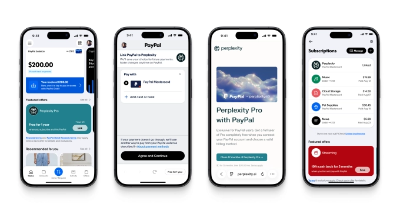

# PayPal和Venmo开始发放Comet浏览器邀请码，还送一年Perplexity Pro会员

---

想用上Perplexity的AI浏览器Comet，但还在排队等邀请码？现在有个更快的办法了。PayPal刚宣布给自家用户发福利：不仅能跳过waitlist直接用Comet，还白送一年价值200美元的Perplexity Pro会员。这对那些想尝试AI搜索工具但又不想掏钱的人来说，算是个不错的切入点。

---

## 这次合作到底在玩什么

Perplexity的Comet浏览器7月才上线，本来只对每月200美元的Max订阅用户和少数内测用户开放。现在PayPal和Venmo的用户突然能插队了——打开app就能领取邀请码和免费会员。

这个浏览器本身集成了AI助手，能自动总结搜索结果、对比产品，还有一些其他功能。听起来像是Chrome加了个聪明的副驾驶。

## PayPal为什么要送这个

表面上看是co-marketing，但PayPal的算盘其实挺清楚：

**拉新用户回app。** 很多人装了PayPal后就放在那吃灰，偶尔付款才打开。现在用Comet邀请码当诱饵，至少能让人重新打开app看看。

**推新功能。** PayPal最近上线了一个订阅管理中心，把你所有定期扣款的服务集中显示。配合这次活动，他们还搞了个促销：绑定三个订阅服务就给50美元。这招挺聪明——先用Perplexity把人吸引过来，顺便让你发现"原来我还订了这么多东西"。

**数据和粘性。** 当用户开始在PayPal里管理订阅，PayPal就掌握了你的消费习惯数据。而且一旦习惯了在这里管理，切换成本就高了。

## Perplexity能得到什么

对Perplexity来说，这波操作也不亏：

**曝光量暴增。** PayPal在美国有几亿用户，这个覆盖面是Perplexity自己砸钱也买不来的。尤其是现在AI浏览器市场刚起步，Chrome还占着大头，👉 [能让更多普通用户知道AI搜索工具的存在](https://pplx.ai/ixkwood69619635)，对Perplexity来说就是赢。

**转化付费用户。** 免费一年听起来很慷慨，但这是个经典的订阅陷阱——很多人用着用着就忘了取消，或者真的觉得好用就续费了。200美元一年对个人用户不算便宜，但如果你已经用了一年，习惯了那些功能，续费的心理门槛就低多了。

**商业闭环测试。** 今年夏天两家公司就合作过，让用户在Perplexity里直接用PayPal或Venmo结账买东西、订机票。现在这次合作相当于把这个闭环扩大了——用户在PayPal里发现Perplexity，在Perplexity里用PayPal付款，形成一个循环。

## 怎么领这个福利

操作很简单：

1. 打开PayPal或Venmo app
2. 找到这个offer（应该会在显眼位置推送）
3. 点击领取，会自动激活Perplexity Pro会员
4. 收到邮件后下载安装Comet浏览器

注意几个限制：
- 每个PayPal账号只能领一次
- 不能是现有的Perplexity Pro付费用户
- 目前主要面向美国用户，其他地区会陆续开放

活动截止到2025年底。

## 这对AI浏览器市场意味着什么

Chrome现在占据浏览器市场的大头，但AI浏览器正在试图改变这个格局。Comet、Arc、Brave等新玩家都在强调"AI原生"体验，而不是像Chrome那样后期加插件。

PayPal这次合作其实给其他AI工具提供了一个思路：与其自己慢慢积累用户，不如找个有流量的平台合作。尤其是支付平台——用户基数大、使用频率高、信任度也够。

对普通用户来说，这是个低成本试错的机会。反正不花钱，试试也无妨。如果真的好用，200美元一年也不算太贵；如果觉得一般，一年后取消就是了。

## 订阅管理这个功能值得关注

PayPal新上线的订阅管理中心其实挺实用。现在谁手机里没有十几个订阅服务？Netflix、Spotify、各种云存储、健身app……很多人自己都记不清每月到底扣了多少钱。

把这些订阅集中显示，至少能让你知道钱花哪了。而且PayPal还能提醒你哪些服务很久没用了，该不该取消。这对那些"订了就忘"的人来说，确实能省点钱。

当然，PayPal的目的不只是帮你省钱。他们更希望你把所有订阅都绑到PayPal上，这样他们就能掌握你的消费数据，未来可以推荐更多服务、收更多手续费。但从用户角度看，只要功能确实好用，这个交换也算公平。

---

## 总结

PayPal和Perplexity这次合作，表面上是送福利，实际上各取所需：PayPal要流量和数据，Perplexity要曝光和付费转化。对用户来说，白嫖一年AI搜索工具不亏，顺便还能试试新浏览器。

如果你本来就在用PayPal或Venmo，不妨领一个试试。👉 [Perplexity的AI搜索在某些场景下确实比传统搜索引擎好用](https://pplx.ai/ixkwood69619635)——尤其是需要快速对比信息、总结长文的时候。至于一年后要不要续费，用过再说。
